# DeepT

Zonotope을 사용한 트랜스포머 검증기를 실험에 사용할 수 있도록 수정

<https://github.com/eth-sri/DeepT>

**DeepT 수정**

1. 데이터 추가

   `DeepT/data/yahoo_data_pair/`밑에 클래스를 2개씩 짝지은 데이터를 따로 저장

   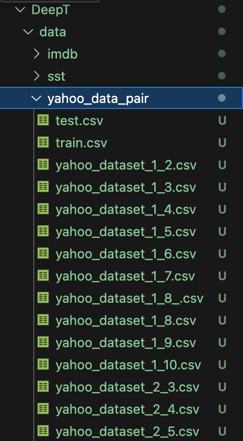

2. yahoo 데이터를 학습시킨 BERT 모델 학습

   기존 BERT 모델은 gelu 활성화 함수를 사용하는데, DeepT에서는 gelu를 지원하지 않기 때문에 ReLU를 사용하는 모델을 새롭게 학습시킴

   - 학습을 시킬 때에는 10개의 클래스에 대해서 모두 학습시키고 클래스 별 모듈을 분해

3. main.py 수정

   while True 문 안에 수정 사항들을 적음(vs code에서 접어두기 위해)

   1. `AutoModelForSequenceClassification`을 사용하여 사전 학습된 모델을 로드

   2. `target.model.classifier`를 수정하여 분류기 레이어의 출력 차원을 변경

      마지막 classifier 부분의 FC 레이어에의 차원을 2개로 축소함. 관심이 있는 클래스(1개)와 관심이 없는 클래스(9개) 중 하나로 구성된 (feature by 2)레이어로 수정됨
      

4. head pruning과 FFNN을 열단위로 프루닝할 수 있도록 함수 추가 (`DeepT/Robustness-Verification-for-Transformers/Models`에 구현됨)

   1. head pruning: 레이어의 모든 헤드가 제거되면, 레이어 자체가 사라질 수 있도록 했음(어텐션 레이어의 파라미터를 제거)

      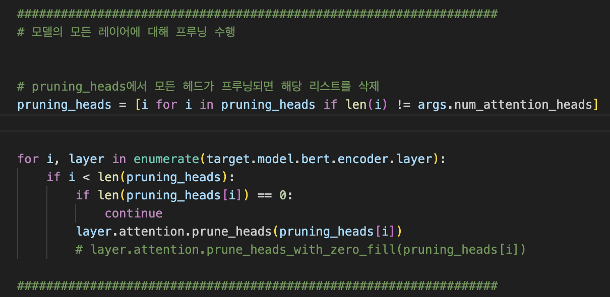

   2. FFNN pruning: 레이어마다, 제거하고 싶은 뉴런의 인덱스를 적으면, 헤당 인덱스 뉴런를 삭제하는 방향으로 제거(노드 앞 뒤의, weight parameter를 짤라내는 방식으로 구현됨)

      - 개별 weight 단위로 프루닝이 되는 방식은, 대상 weight를 0으로 대체

      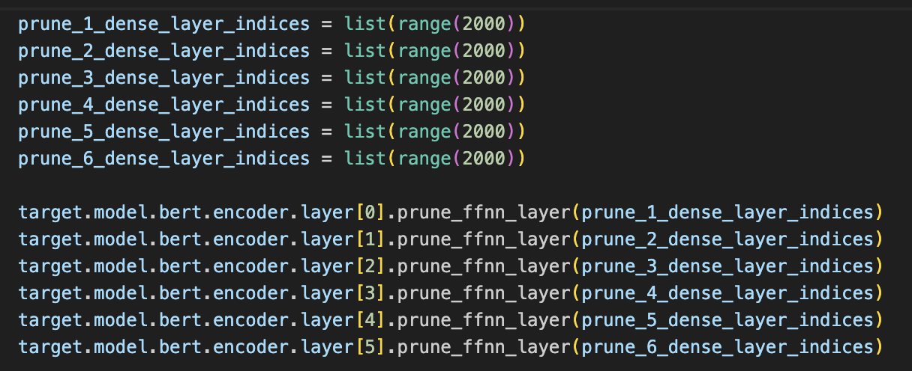

**실험**

1. **분해 전후의 분해 성능 및 시간 비교(헤드 프루닝과 FFNN 프루닝(weight 단위로 잘라냄)을 동시에 수행)**

   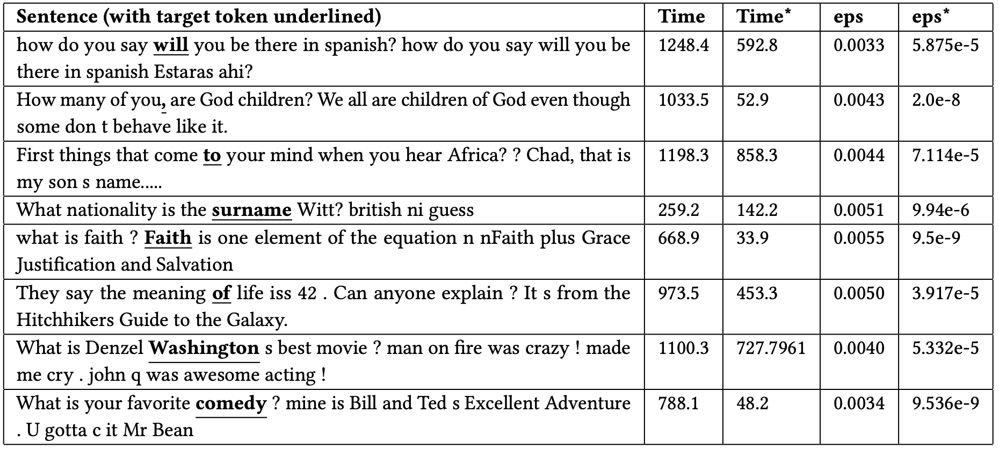

- 시간은 대개 절반 수준으로 깎였으나, eps도 굉장히 많이 깎임

  - eps와 소요 시간 비교

    - [CLS] can unicorn ##s fly ? no n non ##ly pegasus can ! [SEP] 
      - 0.0001          ->  27.524초
      - 0.00000001 ->  27.125초

    

    - [CLS] what comes on earth 1st an egg or a hen ? egg . n n n n n lee ##en [SEP]
      - 0.0000125           -> 61.664초
      - 0.00000000125  -> 56.135초

  - eps가 줄어들면 검증시간이 줄어들기는 하지만, 영향이 아주 크지는 않음

- 위의 표에서 소요시간은 eps 이진 탐색을 포함한 시간이어서 정확한 비교는 아님

2. **헤드 프루닝과 FFNN 프루닝 둘 다 했을 때, 한 개만 했을 때 성능 비교**

   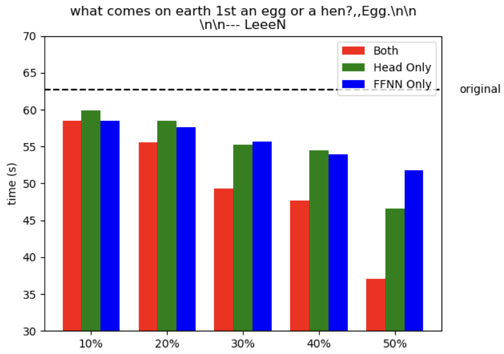

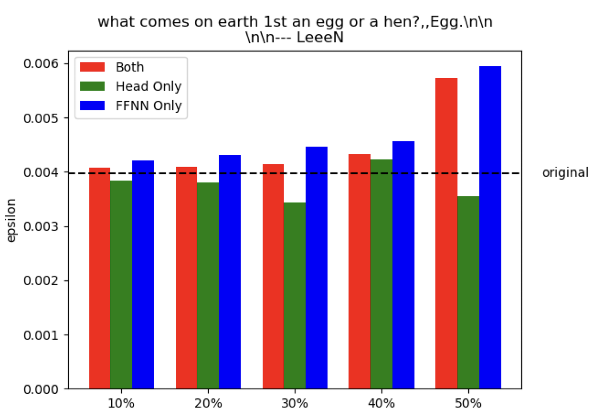

- Head 프루닝만 했을 때와, FFNN 프루닝만 했을 때, 각각의 경우에서 시간 소요량은 단조 감소함
- 검증 eps는 FFNN 프루닝에서는 단조 증가했지만, 헤드 프루닝에서는 명확한 경향성은 보이지 않음
- 동시에 수행했을 때, 시간 소요량은 전체적으로 감소하고, eps는 전체적으로 증가함

3. **뉴런 단위(행 단위, 열 단위) 프루닝과, weight 단위 프루닝 비교**

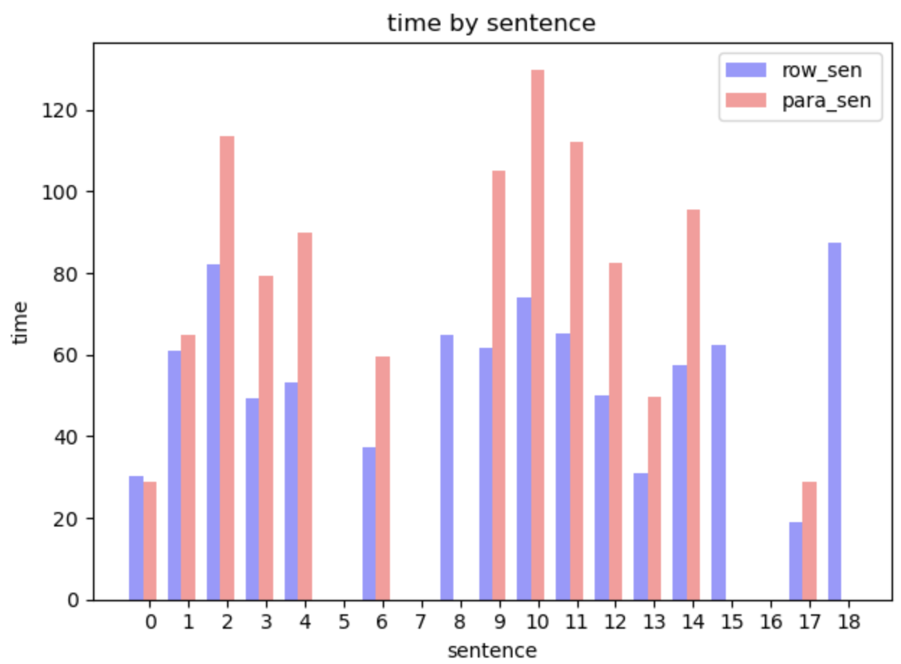

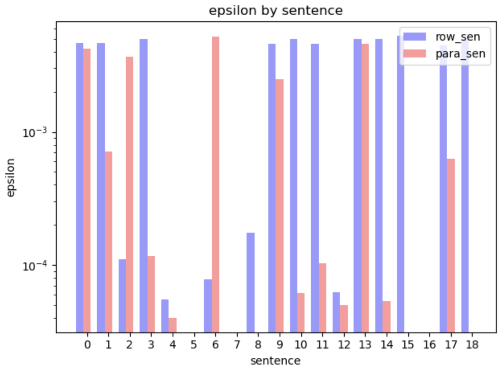

- 헤드와 FFNN 둘 모두에서 50% 수준의 프루닝 수행
- 막대가 없는 것은 검증에 실패한 경우
  - weight 단위로 프루닝했을 때, 검증에 실패하는 경우가 더 많이 나타남
    - 뉴런 단위      : 19 중 15번 성공
    - weight 단위 : 19중 13번 성공
- 아닌 경우도 있으나, 대체로 뉴런 단위로 프루닝했을 때, 시간이 더 적게 소요되고, eps 수준도 상승함

4. **Generation input을 사용한 경우와 사용하지 않은 경우의 DeepT 성능을 비교**

   - 문장 1: can unicorns fly? no n nonly pegasus can!

     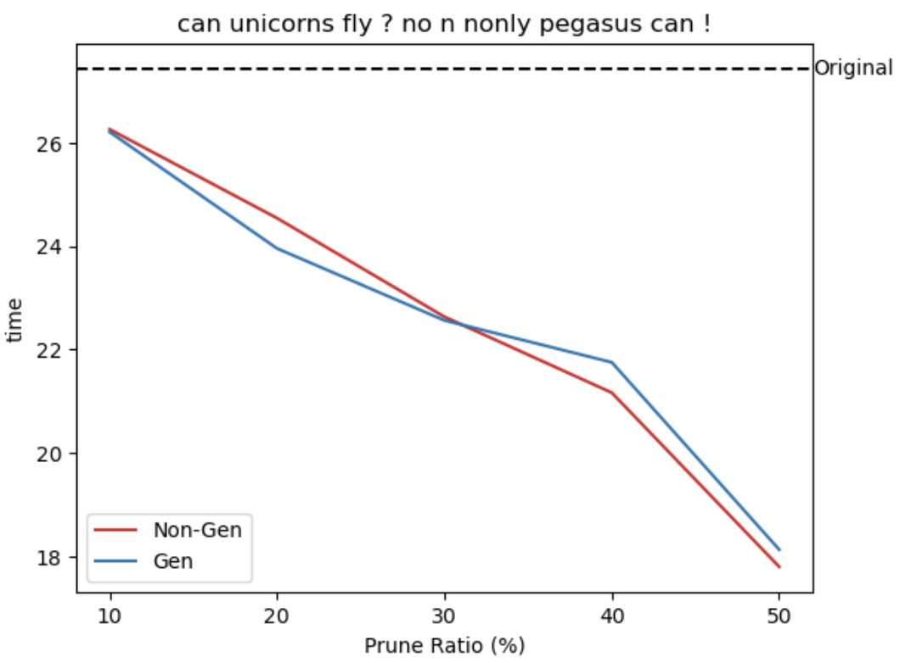

     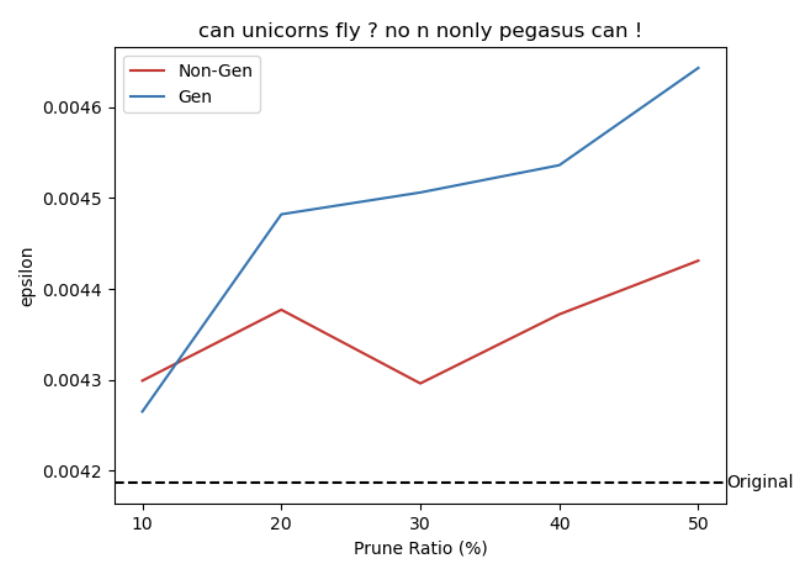

   - 문장 2: what comes on earth 1st an egg or a hen? ,,Egg\n\n\n\n --- LeeeN

     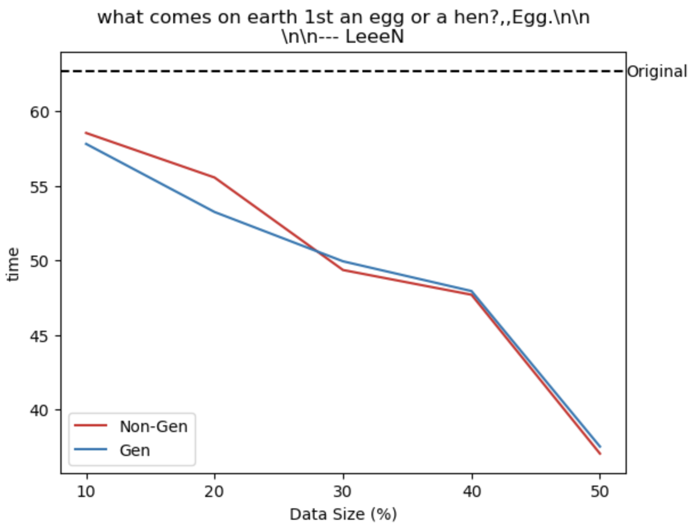

     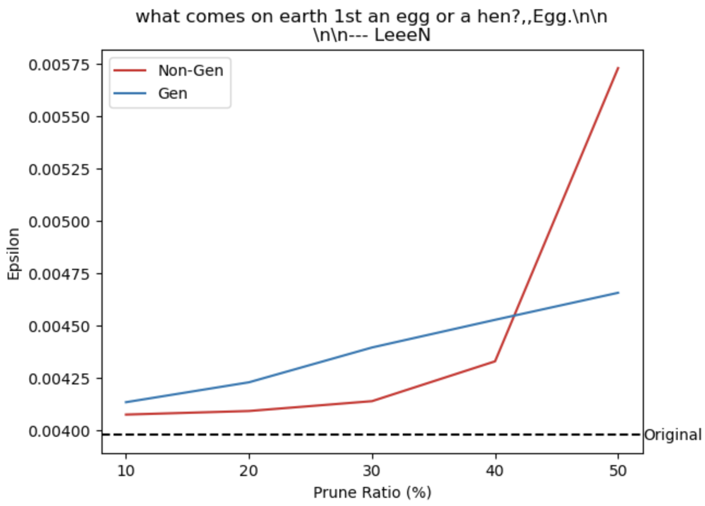

     

   - 두 문장의 실험 결과에서는 명확한 차이가 보이지 않았음

더 추가해야하는 내용

